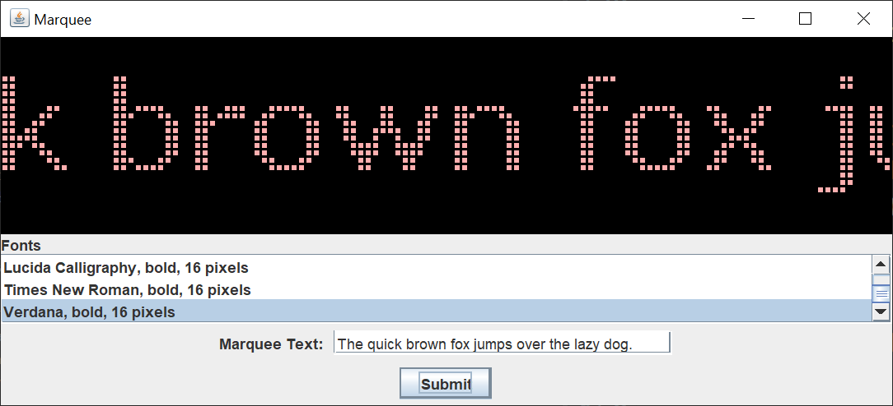
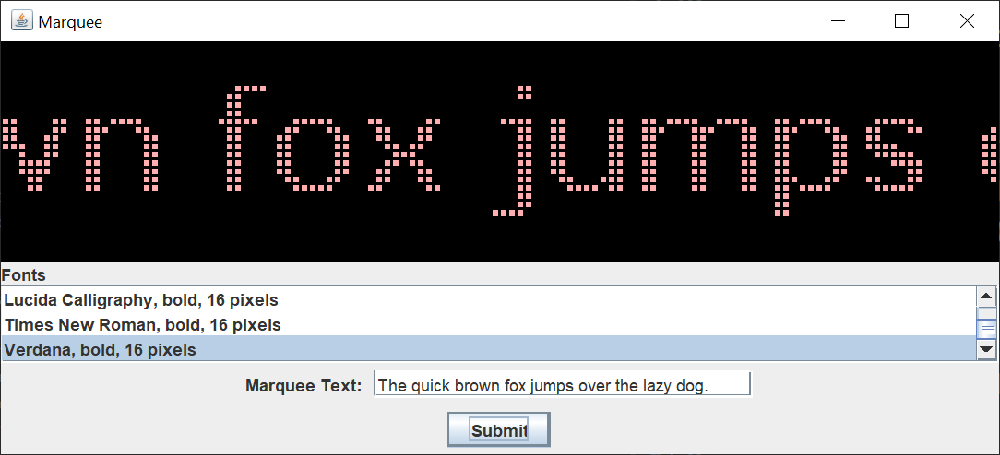

# Marquee

## Introduction

I was walking east on 600 South in Salt Lake City, Utah, when I saw a marquee for a hotel. The letters were purple on black.  The marquee didn’t do anything fancy.  The letters just moved from right to left, so you could read the whole message.

Here’s my Java Swing version of that hotel marquee.

Here it is again , so you can see that the text moved.

The marquee pixels are pink. If the text is shorter than the marquee width, the text is displayed. Otherwise, the text moves from right to left, one column at a time.

You can switch fonts at any time, but you have to resubmit the text to have the new font take effect.

## Explanation

If you’re not familiar with Java Swing, Oracle has an excellent tutorial to get you started, [Creating a GUI With JFC/Swing](https://docs.oracle.com/javase/tutorial/uiswing/index.html). Skip the Netbeans section.

I used the [model / view / controller](https://en.wikipedia.org/wiki/Model%E2%80%93view%E2%80%93controller) (MVC) pattern to code this Swing application. That way, I could separate the concerns and focus on one aspect of the application at a time. I coded 3 model classes, 3 view classes, and 4 controller classes. There are also anonymous and inner controller classes. Generally, I use anonymous classes when the controller classes are short. I use inner classes when I need lots of fields and / or methods from the view class.

This is how I code an MVC Swing application:

1. The view may read values from the model.
2. The view may not update the model.
3. The controller will update the model.
4. The controller will cause the view to update / repaint.

### Model

The MarqueeModel class holds the marquee pixels and the text pixels. Besides the getter and setter methods, there are methods for filling and clearing the marquee pixels, as well as a method for copying the text pixels to the marquee pixels.

The MarqueeFont class holds the marquee information for a font. The getTextPixels method takes a string, draws the string on a BufferedImage, gets the pixels from the BufferedImage, and creates a 2 dimensional boolean array from the pixels.

Pretty clever, eh. It took me 3 tries and 4 months to come up with this obvious method. You should have seen the kludges that I had before. No, I take that back. Be glad you didn’t see the kludges that I had before. Even professional programmers (especially professional programmers?) don’t always get it right the first time.

The pixels are retrieved from the BufferedImage in column, row order. The createTextPixels method flips the pixels so that the 2 dimensional boolean array is in row, column order. We do this so we can draw the pixels column by column on the marquee.

The methods in this class were complicated to debug. I printed lots of values while testing the class. Putting print statements inside a DEBUG boolean is one way to find and solve problems. It’s easier than running the code through the Java debugger some times.

The MarqueeFontFactory class is a List that holds the fonts and the font we chose. We get the largest pixel height of all the fonts. This allows us to add and remove fonts from the addElements method without having to change any constants. The largest font of the ones currently in the list is 22 pixels high.

The default font is also the current font. You can switch fonts at any time, but you have to resubmit the text to have the new font take effect.

### View

In the MarqueFrame class, you’ll notice that we use a JFrame. We do not extend a JFrame. The only time you extend a Swing class (or any other Java class) is when you want to override one of the class methods.

We set the instance of the MarqueeFrame in the MarqueeModel. We do this so we can pass the MarqueeFrame instance to the DisplayTextPixelsRunnable class, so the DisplayTextPixelsRunnable class can repaint the marquee. We create the MarqueeModel before we create the MarqueeFrame, so we have to pass the MarqueeFrame instance to the MarqueeModel with a set method.

The createPartControl method is pretty much boilerplate from project to project. The only difference is the JPanels that make up the project. In this project, we have a marquee panel and a control panel for the font selection, text field, and submit button. We put both panels in a main JPanel, and put the main JPanel in the JFrame. You will save yourself a lot of heartache if you put your panels in a main panel.

The DisplayAllPixelsRunnable class displays all of the pixels for 3 seconds. When you turn a real marquee on, all of the pixels display so that the operator can replace any burnt out bulbs. We simulate that for a bit of realism, and to show how multiple Runnables can be used in a Swing GUI.

The repaintMarqueePanel is a convenience method. That way, the controller doesn’t have to know about the view details. The controller calls the convenience method, which repaints the marquee panel.

The MarqueePanel class extends JPanel because we want to override the paintComponent method. We set the width and height of the panel in the constructor, based on values passed from the model.

In the paintComponent method, we draw the marquee based on values passed from the model. These values will change each time we redraw the panel.

The ControlPanel class is a pretty straightforward Swing class. We put each line of components in their own JPanel, and put the JPanels in a main JPanel. Nesting JPanels in this way allows you to build complicated GUIs.

The JList is probably the most interesting component. We pre-select the default font, so the user doesn’t have to select a font if she’s happy with the default font. We limit the selection to a single font, and set the visible row count to 3. This sizes the JList in proportion to the marquee panel.

### Controller

The first class that we’ll look at is the CreateMarqueeActionListener class.  All of the methods dealing with the marquee are in the model classes, so all we have to do in the actionPerformed method is call the methods. We add a blank before the text and a few blanks after the text so the marquee display looks better.

Next, we’ll look at the FontSelectionListener class.  The actionPerformed method sets the selected font to the default font. The action listener for the submit button will take the text and draw it in the newly selected font.

The last two classes are Runnable classes. We run these classes in separate threads, so we can keep the GUI responsive. First, we’ll look at the DisplayAllPixelsRunnable class.  This class displays all of the marquee pixels for 3 seconds. You can type the marquee text in the JTextField while the pixels are displayed if you’re fast enough.

The marquee panel is repainted inside a call to the SwingUtilities invokeLater method. This ensures that the repaint happens on the Event Dispatch thread.

Finally, we’ll look at the DisplayTextPixelsRunnable class.  This class keeps track of the text pixel position and moves the text one pixel to the left every 50 milliseconds. This moves the marquee at a nice pace.

The marquee panel is repainted inside a call to the SwingUtilities invokeLater method. This ensures that the repaint happens on the Event Dispatch thread.

This class is invoked when the text width is greater than the marquee width. Otherwise, the text is displayed in the marquee without any movement.

